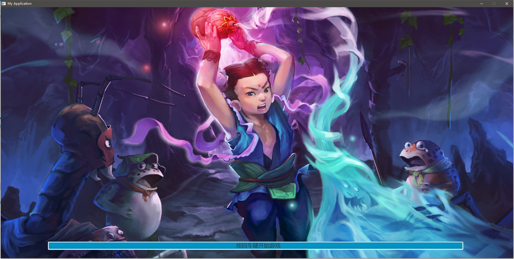
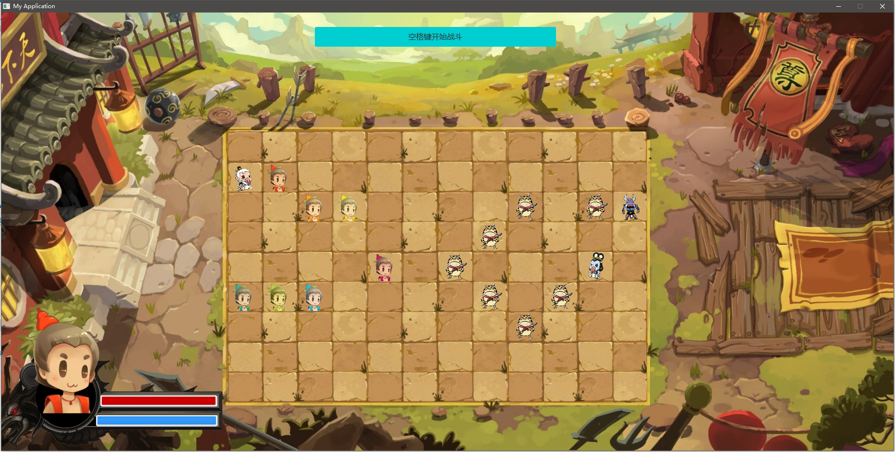
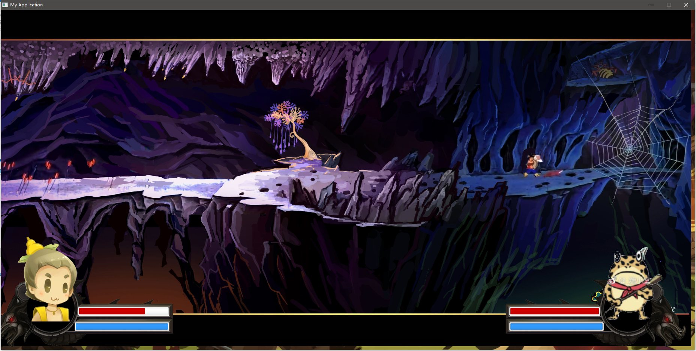
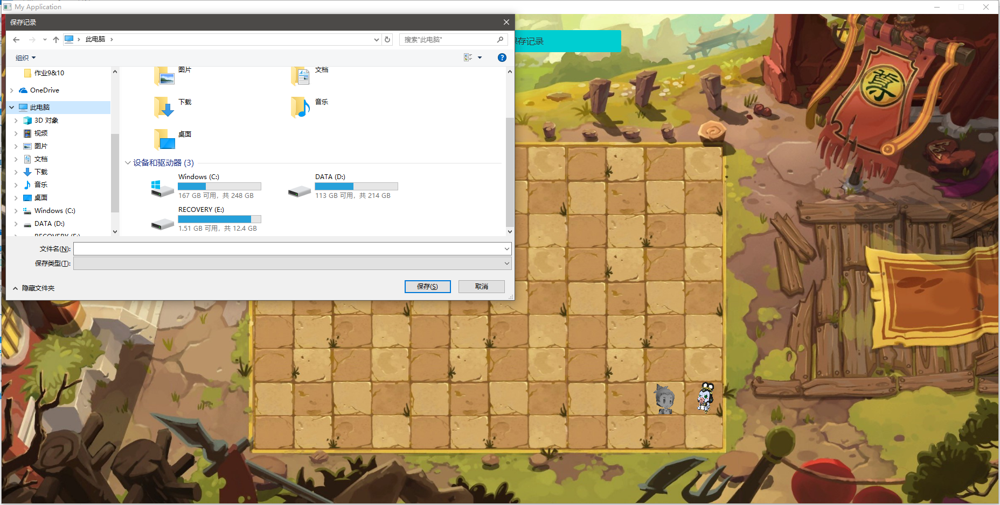

# FinalProject
## 实验运行
+ 战斗回放的存档位置FinalProject/FinalProject/src/main/resources/record.txt    
### 1.
+ 启动程序后，先加载所有的图片资源，load 100%后按回车键开始游戏

### 2.
+ 每一局游戏开场按L键读取存档并运行。  
+ 否则，先后按数字键1-8选择双方阵型，空格开始战斗。（由于地图大小限制，对某些阵型稍做了修改）

### 3.
+ 战斗过程为回合制。葫芦娃和妖怪每个单位依次行动一次，双方都行动完毕为一个回合。为了实现战斗的随机性，战斗过程中，葫芦娃和妖怪以一定概率随机移动，以一定概率指向敌对阵营较多的方向移动。当前行动目标在攻击范围内（以该目标为中心的正方形攻击范围）发现敌方，则展开战斗，进入战斗界面。
+ 战斗界面的战斗仍为回合制，由攻击单位开始，轮流攻击。伤害数值为攻击力。被攻击的一方血条减少。一方单位死亡后回到游戏主战场。战斗过程加入了攻击音效。
+ 死亡单位留下尸体。留有尸体的地图不能站人。每个尸体存在3回合。3回合结束后尸体消失。其他单位方可进入该地图。
+ 当某一阵营全部死亡后，该局游戏结束。

### 4.
+ 游戏结束后按L键保存当前这局的存档。否则该局信息不会保存。
+ 按回车键开始下一局。

## 实验框架
### 1.Creatures类
+ Creatures类生物类。存放了生物的基本属性和基本方法
``` java
public class Creatures extends Thread {
    protected int id;                     // 生物的线程ID, 用于标志线程号，用于处理线程调度。随着运行改变
    protected final int WorldIndex;       // 生物自身ID，不会改变，对应生物的图片等信息
    protected String name;                // 生物名
    protected double HP;                  // 生物当前血量
    protected double MP;                  // 生物当前蓝量
    protected double MaxHP;               // 生物最大血量
    protected double MaxMP;               // 生物最大蓝量
    protected ImageView Appearance;       // 生物外形图片
    protected ImageView AppearanceUI;     // 生物UI
    private ImageView AppearanceVertical; // 生物立绘
    protected boolean isliving;           // 生物是否存活
    protected int deadRound;              // 死亡回合
    protected Point position;             // 当前位置
    protected World MyWorld;              // 生物所处的世界
    protected final int camp;             // 阵营
    protected int ATKRange;               // 攻击范围
    public int AtkValue;                  // 攻击力
    private int MidX;                     
    private int MidY;
    ColoredProgressBar HPProgressBar;     
    ColoredProgressBar MPProgressBar;     // 生物的血条UI
    private int height;     
    private int width;
    protected Animation animation;
    protected int RunMode;                // 行为模式
    
    Creatures(int n, World world, int x, int y, int MyCamp, int Mode) {...}
    public void AddAnimation(Animation animation) {...}         // 生物的动画，由Animation类统一管理
    public void Speak() {...}                                   // 生物的语音
    public void ShowVertical(boolean Start) {...}               // 展示立绘
    protected boolean SearchAndAttack(int x, int y) {...}       // 寻敌并攻击当前敌人
    protected synchronized void Attack() {...}                  // 回合内的完整攻击行为
    protected void UnderAttack(int ATKValue) {...}              // 遭受攻击
    protected synchronized boolean moveto(int x, int y) {...}   // 移动至某一地点
    protected synchronized int FindNextSite() {...}             // 寻找移动的目标地点
    protected synchronized int Move(int index) {...}            // 回合内的完整移动行为
}
```
+ 每个生物在自己的回合内：以一定概率计算下一步的移动位置，向该位置移动。搜寻攻击范围内的敌人，若无敌人则结束该回合。有敌人则进入攻击界面，播放音频和动画，同时攻击该敌人，直至自己死亡或对方死亡为止。结束该回合。
## HuluBrothers类和Monster类继承Creatures类
+ HuluBrothers类和Monster类分别表示葫芦娃和妖怪两个阵营的成员。各自初始化时初始化阵营信息。
+ HuluBrothers类和Monster类单独实现了血条UI的加载。每个类读取配置文件，读取到各自的血条UI的位置，尺寸等信息并加载。
+ 各自实现了run函数，根据不同阵营，采取不同的行为。
## Map类
+ Map类实现了战斗地图。
``` java
public class Map {
    Creatures creatures_in_map[][];      // 生物体数组，存放各生物
    final Point point_of_map[][];        // 每个格子对应的GUI坐标，固定值
    boolean isempty[][];                 // 是否为空标志位
    int height;                          
    int width;                           // 地图大小信息
    int hulu_num;                        // 地图上葫芦娃阵营的存活数
    int mon_num;                         // 地图上妖怪的存活数
    int body_num;                        // 地图上的尸体数

    Map() {...}
    public synchronized void Arrive(int x, int y, Creatures creature) {...}   // 地图某位置有生物到达
    public synchronized void Leave(int x, int y) {...}                        // 地图某位置有生物离开
    public synchronized void RemoveCreature(int x, int y) {...}               // 3回合后移除地图上的尸体
    public synchronized void Clear() {...}                                    // 地图清空
}
```
## World类
+ World类记录了整个葫芦娃世界的信息和方法
``` java
public class World {
    private int CreaturesNum;                     // 生物体个数
    public Button button;                         
    public Creatures []creatures;                 // 生物
    public Image[]Img;                            // 生物图片
    public Image[]ImgDead;                        // 生物死亡图片
    public Image[]ImgUI;                          // UI图片
    public Image[]ImgVertical;                    // 生物立绘
    public ColoredProgressBar []HPProgressBar;    
    public ColoredProgressBar []MPProgressBar;    // 生物血条UI
    public Map map;                               // 地图
    public AnchorPane Root;
    public Task<Void> LoadTask;                   // 初始图片加载任务

    World (AnchorPane root) {}
    private void InitializeProgressBar() {}                                             // 初始化进度条作为血条
    public void Clear() {}                                                              // 重置世界信息至游戏开始状态
    public void InitializeFormation(int FormationType, int mode, int enter_flag) {}     // 初始化阵型，是葫芦娃和妖怪们按阵型站队
    public int getCreaturesNum() {}
    public void LetCreaturesRun(Animation animation) {}                                 // 让所有生物线程动起来
    public void SetUIVisible(int id, boolean Visible) {}                                // 控制UI的显示与否
    public void UpdateUI(int id) {}                                                     // 更新血条UI的数值
    public void SetButtonText(String str) {}
    public void LoadAllImage () {}                                                      // 启动游戏时加载所有图片，采用Task实时显示加载进度
    public void EnterAttack() {}                                                        // 进入战斗界面
    public void LeaveAttack() {}                                                        // 离开战斗界面
}
```
## Main类
+ Main类负责用户交互，程序的启动等操作。
``` java
public class Main extends Application {
    private World world;                                              // 葫芦娃世界
    private AnchorPane root;                                          // AnchorPane
    public static Semaphore[] mutexi;                                 // 信号量
    public static int thread_num;                                     // 生物线程数
    public static int enter_flag = -1;                              
    public static ReadRecord readrecord;                              // 存档记录保存
    public static ArrayList<String> FileList = new ArrayList<>();     // 记录信息
}
```
## 线程调度
+ 由于采用回合制，每一回合每个单位依次行动。所以线程采用了信号量调度。参考操作系统的PV操作。
+ Main中的
``` java
public static Semaphore[] mutexi;
```
+ 存放了信号量数组，当前单位行动时申请自己的信号量，当获得信号量后开始自己的回合。回合结束释放下一个行动单位的信号量。使得下一单位行动。  
+ 信号量初始如下：每一单位的信号量均初始为0，只有第一个行动的单位信号量初始为1。
``` java
thread_num = world.getCreaturesNum();                 // 根据生物体个数获取线程号
mutexi = new Semaphore[thread_num];                   // 初始化信号量
mutexi[0] = new Semaphore(1);
for (int i = 1; i <= thread_num - 1; i++)
    mutexi[i] = new Semaphore(0);
```
``` java
try {
    Main.mutexi[id].acquire();                        // 申请当前信号量
} catch (InterruptedException e) {
    e.printStackTrace();
}
//自己回合的行动
Main.mutexi[(id + 1) % Main.thread_num].release();    // 释放下一单位信号量
```
## Javafx
+ javafx使用了AnchorPane, 加载fxml文件初始化界面。
+ 所有的生物的移动均使用了Animation动画。生物体的外形是一个ImageView类型的图片。生物移动坐标变化。图片利用动画移动。
``` java
javafx.scene.shape.Path path = new javafx.scene.shape.Path();
path.getElements().add(new MoveTo(from_x, from_y));
path.getElements().add(new LineTo(to_x, to_y));
PathTransition pt = new PathTransition();
pt.setDuration(Duration.millis(speed));
pt.setPath(path);
pt.setNode(image);
pt.setAutoReverse(false);
pt.play();
```
+ 用户交互实现了javafx的键盘和鼠标事件。
``` java
world.button.setOnMouseClicked(new EventHandler<MouseEvent>() {
    @Override
    public void handle(MouseEvent event) {
        if (event.getButton() == MouseButton.PRIMARY && event.getClickCount() == 2) {
            root.requestFocus();
        } else if (event.getButton() == MouseButton.PRIMARY && event.getClickCount() == 1) {
            root.requestFocus();
        }
    }
});
```
## 文件存取
+ 战斗记录的保存格式为ID 移动信息。由于生物的移动有一定的概率是随机的。所以将移动方向保存。
+ 战斗回访是一个线程，该线程读取记录，并按记录中的ID号，按顺序释放对应生物线程的信号量。生物因此按记录的顺序回访战斗。
